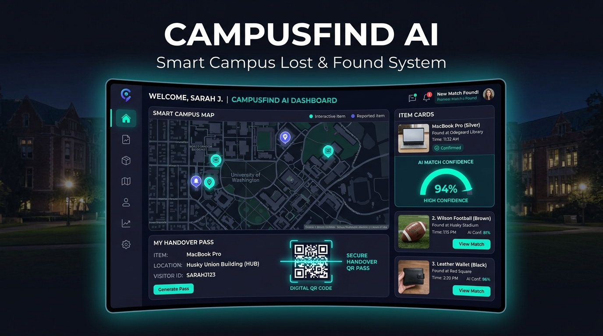
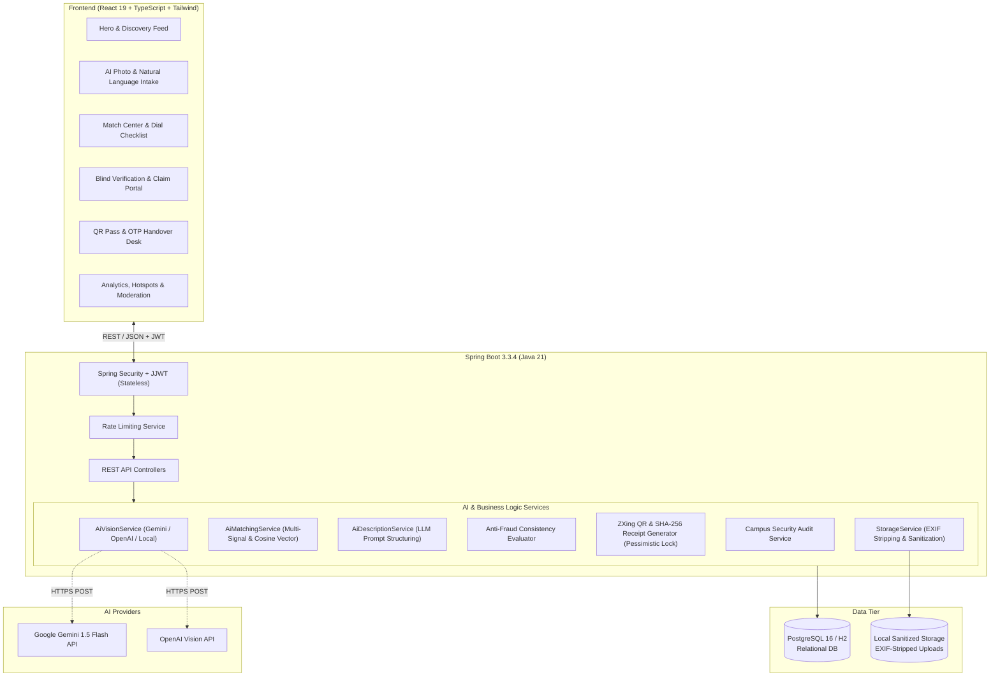
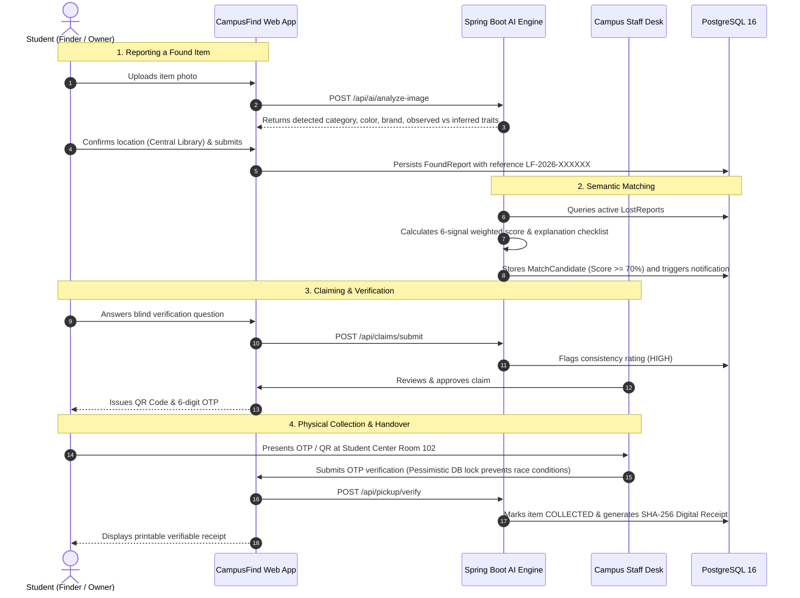

# CampusFind AI — Smart Campus Lost & Found Management System

<p align="center">
  
</p>

<p align="center">
  
  
  
  
  
  
  
  
</p>

> **CampusFind AI** is an enterprise-grade, privacy-first Smart Campus Lost & Found ecosystem powered by **Multimodal Computer Vision**, **Explainable Multi-Signal Semantic Matching (6 signals)**, and **Cryptographic QR + OTP Handover Verification with SHA-256 Digital Receipts**.

---

## 🌟 Highlights & Key Innovations

1. **Multimodal AI Vision Feature Extraction (Gemini 1.5 Flash / OpenAI GPT-4o / Local Fallback)**:
   - Configurable AI provider (`AI_PROVIDER=gemini|openai|local`) using real multimodal vision models without external dependencies (`java.net.http.HttpClient`).
   - Analyzes uploaded photos to extract item category, subcategory, dominant color, brand emblems, and materials.
   - Distinct separation between **Observed Visual Evidence** (100% confidence) and **Inferred Attributes** (probabilistic context).
   - Generates anti-fraud **Blind Verification Questions** (e.g., hidden stickers, internal lining, serial numbers).
   - Graceful fallback: If external AI is offline or credentials are missing, system returns clear notification (`"AI assistance is temporarily unavailable"`) and allows full manual editing without crashing.

2. **Explainable Multi-Signal Semantic Matching Engine**:
   - Calculates weighted confidence scores across six core signals with configurable weights (`application.yml` / ENV):
     - **Category Match**: 25% (Weight: 0.25)
     - **Color Compatibility**: 15% (Weight: 0.15)
     - **Brand Alignment**: 15% (Weight: 0.15)
     - **Campus Location & Proximity**: 15% (Weight: 0.15)
     - **Loss vs. Found Time Delta**: 10% (Weight: 0.10)
     - **Semantic Vector / Cosine Similarity**: 20% (Weight: 0.20)
   - Dynamic weight normalization: When optional attributes (like brand) are unavailable, weights automatically re-normalize so scores remain truthful.
   - Provides clear, human-readable justification checklists (`✓ Same Category`, `✓ Matching Brand: Nike`, `✓ Nearby Campus Location`) rather than black-box scores.
   - Automatically issues notifications when match confidence exceeds **70%**.

3. **Zero-Knowledge Anti-Fraud & Privacy Masking**:
   - Public feeds and search results strictly mask private identifying traits (e.g., wallet contents, student ID numbers `STU-****-8841`).
   - Claimants must answer blind verification questions to prove authentic ownership before any approval or appointment booking.
   - Public registration strictly enforces `ROLE_STUDENT` regardless of client payload.

4. **Contactless Pickup Pass & Digital Handover Receipt**:
   - Generates dynamic ZXing QR codes + synchronized 6-digit OTP (`482731`).
   - Staff collection desk performs instant verification with pessimistic database locking (`@Lock(LockModeType.PESSIMISTIC_WRITE)`) to eliminate handover race conditions.
   - Generates immutable digital receipts stamped with a **SHA-256 cryptographic signature** for campus audit compliance.

5. **Storage & Rate Limiting Architecture**:
   - Pluggable `StorageService` interface (`LocalStorageService` for dev, easily extensible to S3/MinIO) with strict path traversal checks, file size limits, and EXIF stripping via `ImageIO` re-rendering.
   - In-memory sliding-window bucket rate limiting for authentication, claim submissions, and AI vision calls.

---

## 📐 System Architecture



---

## ⚙️ Environment Variables & Configuration

Copy `.env.example` or export the following variables:

```bash
# Database Settings
DATABASE_URL=jdbc:postgresql://localhost:5432/campusfind_db
DATABASE_USERNAME=postgres
DATABASE_PASSWORD=postgres

# Security & JWT
JWT_SECRET=404E635266556A586E3272357538782F413F4428472B4B6250645367566B5970

# Real AI Multimodal Vision & Description
AI_PROVIDER=gemini            # options: gemini | openai | local
AI_API_KEY=your_gemini_api_key_here
AI_MODEL=gemini-1.5-flash     # or gpt-4o-mini
AI_TIMEOUT_MS=15000

# Storage
STORAGE_PATH=./uploads

# Matching Signal Weights (Must sum to 1.0)
MATCH_WEIGHT_CATEGORY=0.25
MATCH_WEIGHT_COLOR=0.15
MATCH_WEIGHT_BRAND=0.15
MATCH_WEIGHT_LOCATION=0.15
MATCH_WEIGHT_TIME=0.10
MATCH_WEIGHT_SEMANTIC=0.20
```

---

## 🔄 End-to-End Handover Flow



---

## 🗂️ Project Structure

```
smart-campus-lost-found/
├── .env.example                            # Production & development environment template
├── backend/                                # Spring Boot 3.3.4 Application
│   ├── pom.xml                             # Dependencies: JPA, Security, JJWT, ZXing, Postgres, H2
│   └── src/
│       ├── main/java/com/campusfind/
│       │   ├── config/                     # Cors & Security configuration
│       │   ├── controller/                 # 12 REST Controllers (Auth, Found, Lost, Pickup, AI, etc.)
│       │   ├── dto/                        # Clean typed request/response transfer objects
│       │   ├── exception/                  # GlobalExceptionHandler & safe error mapping
│       │   ├── model/                      # JPA Entities (FoundReport, Claim, PickupAppointment, etc.)
│       │   ├── repository/                 # Repositories with pessimistic locks & specifications
│       │   ├── security/                   # JwtTokenProvider, Filter, CustomUserDetailsService
│       │   └── service/                    # Business services, AI Vision (Gemini/OpenAI), Matching, Storage
│       └── test/java/com/campusfind/       # Unit & Integration test suite (100% pass)
│
└── frontend/                               # React 19 + TypeScript + Vite + Tailwind CSS
    ├── index.html                          # Semantic HTML5 entry with modern typography
    ├── package.json                        # Dependencies (Lucide icons, Canvas Confetti)
    ├── vite.config.ts                      # Dev server proxying /api & /uploads to :8080
    └── src/
        ├── components/                     # Navbar, HeroSection, Modals, AuthModal, DemoBanner
        ├── views/                          # 7 Primary Page Views
        │   ├── ReportFoundView.tsx         # AI photo scan, observed vs inferred, 5-step stepper
        │   ├── ReportLostView.tsx          # Conversational AI assistant & prompt structuring
        │   ├── BrowseItemsView.tsx         # Privacy-masked directory, filters, search
        │   ├── MatchCenterView.tsx         # Side-by-side comparison, signal breakdown bars
        │   ├── PickupDeskView.tsx          # Student QR pass & Staff Handover terminal
        │   ├── MyActivityView.tsx          # Student portal for submissions & claims
        │   └── AdminDashboardView.tsx      # KPIs, Campus Heatmap, Moderation & Audit
        ├── services/api.ts                 # Typed Axios REST API client
        └── types/index.ts                  # Comprehensive TypeScript models
```

---

## ⚡ Quick Start Guide

### Prerequisites
- **Java 21 JDK** installed (`java -version`)
- **Maven 3.8+** installed (`mvn -version`)
- **Node.js 18+** & **npm 9+** installed (`node -v`)
- **PostgreSQL 16** running on `localhost:5432` with database `campusfind_db` (or test profile with H2)

### 1. Database Setup
```sql
CREATE DATABASE campusfind_db;
CREATE USER postgres WITH PASSWORD 'postgres';
GRANT ALL PRIVILEGES ON DATABASE campusfind_db TO postgres;
```

### 2. Run Backend (Port 8080)
```bash
cd smart-campus-lost-found/backend

# Run test suite
mvn test

# Start the Spring Boot server
mvn spring-boot:run
```
*The application initializes campus reference data, seed users, 8 buildings, 11 categories, and active test items automatically on first start.*

### 3. Run Frontend (Port 5173)
```bash
cd smart-campus-lost-found/frontend

# Install dependencies
npm install

# Start Vite development server
npm run dev
```
Open **`http://localhost:5173`** in your browser.

---

## 🔑 Demo Personas & Fast Role Switcher

You can switch between personas directly in the UI using the top navigation switcher or demo banner:

| Persona | Role | Email | Password | Permissions |
| :--- | :--- | :--- | :--- | :--- |
| **Alex Chen** | `ROLE_STUDENT` | `student@campus.edu` | `Password123!` | Report lost/found, submit claims, view QR pass |
| **Sarah Jenkins** | `ROLE_STAFF` | `staff@campus.edu` | `Password123!` | Verify OTPs, issue digital receipts, claim review |
| **Campus Administrator**| `ROLE_ADMIN` | `admin@campus.edu` | `Password123!` | Incident heatmap, audit logs, user management |
| **Priya Sharma** | `ROLE_STUDENT` | `priya@campus.edu` | `Password123!` | Peer student claimant |

---

## 📡 Key API Endpoints

| Method | Endpoint | Access | Purpose |
| :--- | :--- | :--- | :--- |
| `POST` | `/api/auth/login` | Public | Authenticate user and receive JWT bearer token (Rate limited) |
| `POST` | `/api/auth/register` | Public | Self-registration (Strictly assigns `ROLE_STUDENT`) |
| `GET` | `/api/locations` | Public | Retrieve 8 campus building zones and coordinates |
| `GET` | `/api/categories` | Public | Retrieve item taxonomy |
| `POST` | `/api/ai/analyze-image` | Public | Multimodal visual attribute extraction & validation (Gemini/OpenAI) |
| `POST` | `/api/ai/assist-description`| Public | Conversational description parsing |
| `GET` | `/api/found` | Public | Privacy-masked list of found items |
| `POST` | `/api/found` | Student/Staff | Submit a new found item with secret verification details |
| `GET` | `/api/matches/my-matches` | Student | View personalized AI match candidates with score breakdown |
| `POST` | `/api/claims/submit` | Student | Submit claim with blind verification answers |
| `POST` | `/api/pickup/verify` | Staff/Admin | Pessimistic locked OTP/QR verification and signed receipt |
| `GET` | `/api/admin/dashboard` | Staff/Admin | Retrieve real-time KPIs and building incident heatmap |
| `GET` | `/api/admin/audit-logs` | Staff/Admin | Query compliance audit log |

---

## 🛡️ Privacy & Security Features
- **Stateless JJWT Authentication**: HS-512 signatures with 24-hour expiration.
- **Role Escalation Protection**: Public register endpoint forces `ROLE_STUDENT`.
- **EXIF Sanitization & Storage Abstraction**: `LocalStorageService` safely strips camera EXIF/GPS metadata via `ImageIO` re-rendering and blocks directory traversal.
- **Zero Exposure**: Secret identifying markers (`privateVerificationDetails`) are sanitized from all public DTOs.
- **Pessimistic Concurrency**: Eliminates double-collection race conditions when verifying pickup OTP codes.
- **Rate Limiting**: Sliding window in-memory protection across auth, claims, and AI endpoints.
- **Cryptographic Receipt Signature**: SHA-256 HMAC digest generated using secret campus salt, claimant ID, staff ID, and timestamp to prevent counterfeit collection receipts.

---

## 🧪 Testing & Quality Assurance
Run backend automated tests:
```bash
cd smart-campus-lost-found/backend
mvn test
```
**Test Coverage:**
- `AiMatchingEngineTest`: Verifies multi-signal mathematical weights, category gating, time penalty, and color compatibility.
- `AuthAndSecurityTest`: Verifies password hashing, JWT claims, role authorization, and registration role enforcement.
- `AiServicesTest`: Verifies Gemini/OpenAI vision integration and graceful fallback when external AI is offline.
- `WorkflowIntegrationTest`: Verifies full end-to-end flow: Found Report creation $\rightarrow$ Semantic Match detection $\rightarrow$ Claim submission $\rightarrow$ Handover verification $\rightarrow$ Cryptographic receipt generation.

---

## 📄 License
This project is open-source and built for university campus deployment under the MIT License.
